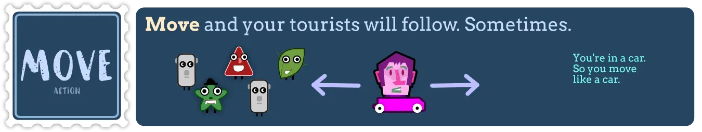
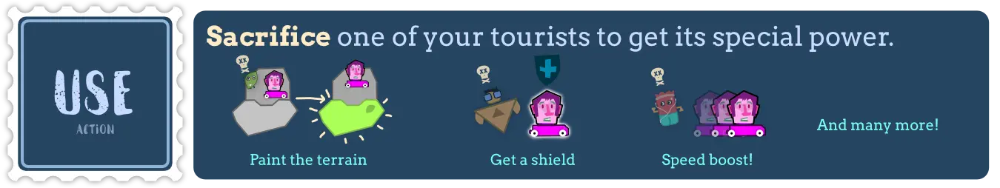
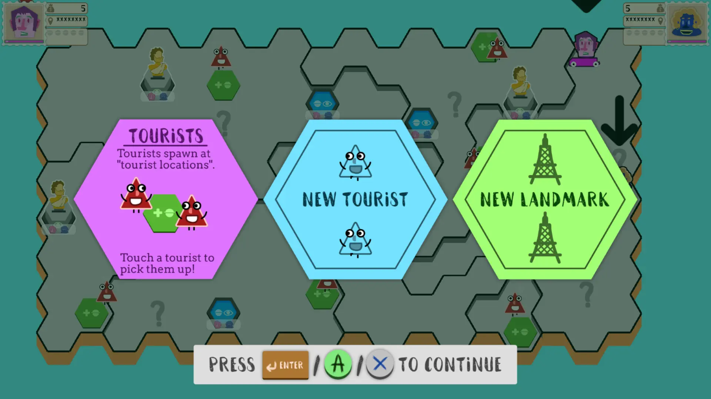
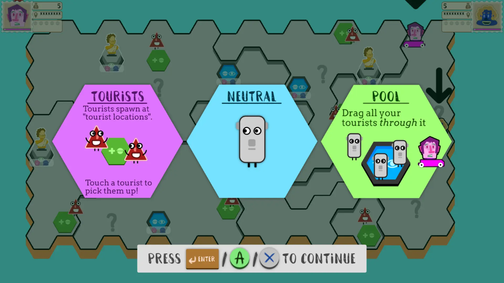

{}

{}
	 
		Buy (&euro;5)
	

	 
		Try (Free Demo)
	
{}

{}

Welcome to your new job as a tour guide!

You must be excited to guide these well-paying tourists to beautiful landmarks. I mean, who hasn't heard of the _Eiffel shower_? Or the _Leaning Tower of Pizza_?

But what’s this? It seems our rival companies appeared here at the same time!&nbsp;And is ... is that a crocodile sneaking towards your tourists?

You know what? I'll be going now, good luck! Guide your tourists to all landmarks on the map before anyone else &hellip; and without – ehm – “losing” too many of them.

We're glad to have you at the _Company of the Tackling Tourists_!

{}

<!-- Section 1 -->

	

{}

A random world is generated, full of wonderful landmarks, but also full of hazards.

**Be the first player to succesfully visit all landmarks.** (Which gets you into the Taj Mahall of Fame.)

To help with that, you'll need to pick up the right tourists along the way ... and lose them when they've become a burden.

_The Hanging Barbers_ must be visited in the correct order, whilst the _Unique Horn_ can only be visited with unique tourists, and the _Kilivanjaro_ will drive around the map changing location.

A game about being more speedy and creative than the other players, which comes down to good tourist management, quick reflexes amidst the chaos, and smart strategy.

Oh, and, when two players meet, they might just tackle each other off the map. Which, you know, is bad for the reviews.

{}

<!-- Section 2 -->

	

{}

This game supports **1&ndash;4 players** (locally) using whatever combination of **controllers and keyboard** you want. Games last roughly **5 minutes**.

Accessible to anyone &mdash; with one simple objective and control &mdash; but with enormous depth for those that seek it. As they say: easy to pick up, hard to master.

To play the game, you only need one control.

Once more hazards appear, however, you'll long for stronger and more varied movement.

{}

<!-- Section 3 -->

	

{}

	

This game uses a new "tutorial" system I invented, after many frustrations with how games teach themselves.

It removes any annoying "upfront learning" and makes learning the game a piece of cake!

Each time you start the next _campaign_ level, you are shown 1-3 "cards".

	

Press anything to reveal ( = flip) the next card. It will give you one new snippet of information, with text and images, like "new control: dashing" or "new landmark: the eiffel shower".

Once all cards are flipped, the game starts!

This way, the game never overwhelms you with information, you can read the new bits at your own pace, and will be playing within 30 seconds. (Anything that can be taught interactively, such as which buttons to press, is done so.)

{}

<!-- Section 4 -->

	

{}

The **full game** contains 20 terrain types, 20 tourist types, and 30 landmarks.

If you choose the **campaign**, you'll learn all these elements in order, each level adding one new cool thing. (The first worlds teach essential mechanics. You could easily stop there, if you're satisfied with that. The rest can be seen as "DLCs".)

If you choose **free play**, you handpick the elements you want to appear, creating a random world that only contains the landmarks/tourists/terrain _you_ like best.

Want to get a taste first? There's a **generous demo version**. My main goal with these games is to give people cool experiences to enjoy together, not make as much money as possible. Additionally, I believe you have the right to test games before buying, _especially_ local multiplayer ones.

This demo contains the first 4 worlds of the campaign and 9 options per element (terrain/tourist/landmark) in free play. It's completely free to download, play, and enjoy forever.

_Remark:_ to make the game as easy to understand as possible, especially for non-English players, it communicates a lot via icons (on landmarks, when giving feedback, etc.). This can be turned off in the settings, if you prefer written (English) feedback.

{}

<!-- Section 5 -->

	

{}

For the details behind development, visit my devlog: [Company of the Tackling Tourists](/blog/videogames/devlog-company-of-the-tackling-tourists)

Play my other local multiplayer games:
- [A Recipe for Disaster](https://pandaqi.com/a-recipe-for-disaster)
- [I Wish You Good Hug](https://pandaqi.com/i-wish-you-good-hug)
- [Totems of Tag](https://pandaqi.com/totems-of-tag)

If you played the game, let me know! Feedback, positive or negative, is always good.

This game is finished, but that doesn't mean the idea is finished. With some major changes to its core, I think the game could shine as a 3D (party)game with&nbsp;support for 1-6 players. If this game becomes popular enough, and with your valuable feedback, that sequel will be made!

{}