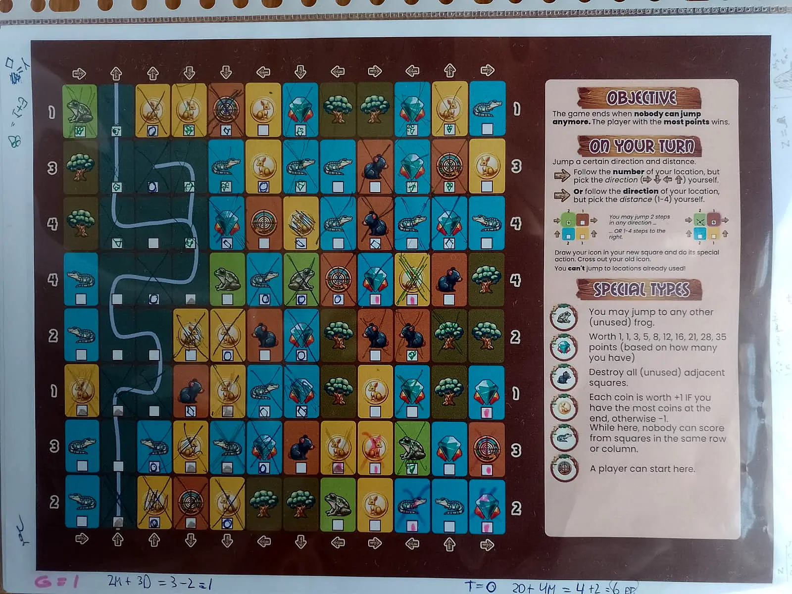

{}

Hop along the smartest route to collect points and powers---before your opponents blocked all your desired jumps.

{}

{}

[Generate](#board) a paper below. Or click the "Download" button to find a PDF I already generated for you.

Print and play!

If you didn't add rules on the paper itself---or just want more clarification---read the short [playful rules](rules).

{}

{}

Input your desired settings and click "generate".


  
  
  
  
  
  


<strong>Not working?</strong> Don't worry! At the "Download" link, you can also find PDFs I already generated for you.
 

{}

{}

I've used the fonts **Mail Ray Stuff** (headings, thick) and **Poppins** (body, thin). The latter is freely available on Google Fonts, the first was received from 1001fonts.

Idea, rules, code and assets are completely mine. A generative AI was used for some parts, especially the animals, though parts were edited or redrawn by me. (If you ask the AI to create a Wolf Spider for example, a common animal in Australia, it just blends a Wolf and a Spider ... while getting the number of legs wrong. Every time.)

This idea started when I woke up one morning and had this pressing thought about a kangaroo game. By the time I got downstairs and could write it down, it had already evolved into a simple but powerful mechanic that could sustain a whole game.

This might be the simplest One Paper Game I ever made, while having a lot of depth and a theme that makes total sense. 

That was a good morning.

Want more details? Check out the [devlog](https://pandaqi.com/blog/boardgames/kangaruse).

Below is a quick image (from my cheap phone) of one early test game we played.

As usual, my players stubbornly insisted on complicated icons and aggressively crossing out squares from opponents who just blocked their move ;) Otherwise, this is fairly representative of what a finished game looks like.

{}