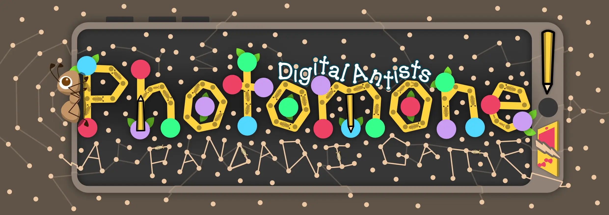

<!-- 
 -->

  

<!-- <h2 style="text-align: center; filter: drop-shadow(0 0 4px black);">Try it!</h2> -->

Use this demo to instantly try Photomone (and if it works on your device). Once you're ready to start an actual game, scroll down to <a href="#game">the game</a>.

{}

Input your settings, click the button. A new page opens and you can immediately play

If unsure, just leave all settings as they are.


  
  
  
  
  
    
  


{}



{}

This game is a (completely digital) spin-off for [Photomone](https://pandaqi.com/photomone). It is played on one device (preferably a tablet or smartphone), instead of drawing on a physical paper. It's simplified in some ways, and changed in others to use the computer for cool stuff!

For a detailed diary about the game, check out the [devlog](/blog/boardgames/photomone-digital-antists).

Photomone now has a spin-off that turns the game on its head. The result is something similar to popular games like "Codenames". Check out <a href="https://pandaqi.com/photomone-antsassins/">Photomone: Antsassins</a>.

{}

