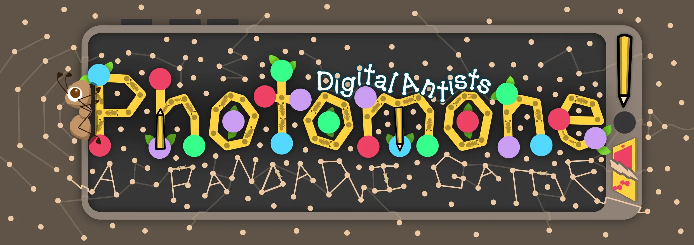

<!-- 
 -->

  

<!-- <h2 style="text-align: center; filter: drop-shadow(0 0 4px black);">Try it!</h2> -->

Use this demo to instantly try Photomone (and if it works on your device). Once you're ready to start an actual game, scroll down to <a href="#game">the game</a>.

## Game

Input your settings, click the button. A new page opens and you can immediately play.

If unsure, just leave all settings as they are.


  
  
  
  
  
    
  


## Credits

Check out the main page for [Photomone Games](/photomone-games/) for detailed credits and more information.

This game is basically the same as the original Photomone, except of course that it's _digital_!

It is played on one device (preferably a tablet or smartphone), instead of drawing on a physical paper. It's simplified in some ways, and changed in others to use the computer for cool stuff! 

This was one of the first instances where I realized just how powerful the addition of one device can be for some games. It can take away any downtime or setup (the computer handles it for you!) and remove the need to print or carry material. That's why I started doing hybrid games a lot more after this one (and the [Keebble Games](/keebble-games/).)

For some games it's still a bad idea, though. That is why 90+% of my board games are still completely analog, and that will probably not change much in the future.

For a detailed diary about the game, check out the [devlog](/blog/boardgames/photomone-digital-antists).

