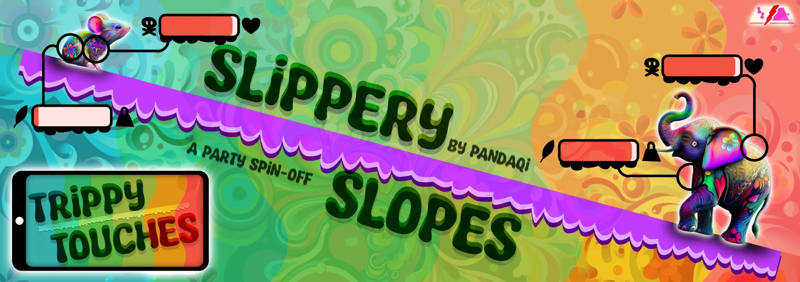

  

    
  

{}

How would you communicate the word <strong>"..."</strong> using only the four sliders below?

(Use your mouse/finger to move them!)

Congratulations, you've just learned how to play this quick party game! Use the section below to start an official game on your phone. Or <a href="" id="slippery-reload-button">refresh this example</a> as much as you like.

{}

{}

Input your settings, click the button. The game opens in a new page and explains itself as you go!


  
  
    
    
  


{}



{}

This game is the "digital" version of [Slippery Slopes](/slippery-slopes/). If you want a physical (offline) version of this idea, with more expansions and sliders, check that out!

While finishing that project, I realized there was nothing standing in the way of creating a digital version. The core of this game has only two parts (draw random words, mark something on a slider), and both of those are easy to do on a website, on any device.

Well, you know me, if I think "it shouldn't be _too_ hard to ..." then I've basically decided to try and make it this very weekend.

For more information, I refer you to the original game (and its credits/devlog at the bottom)!

{}